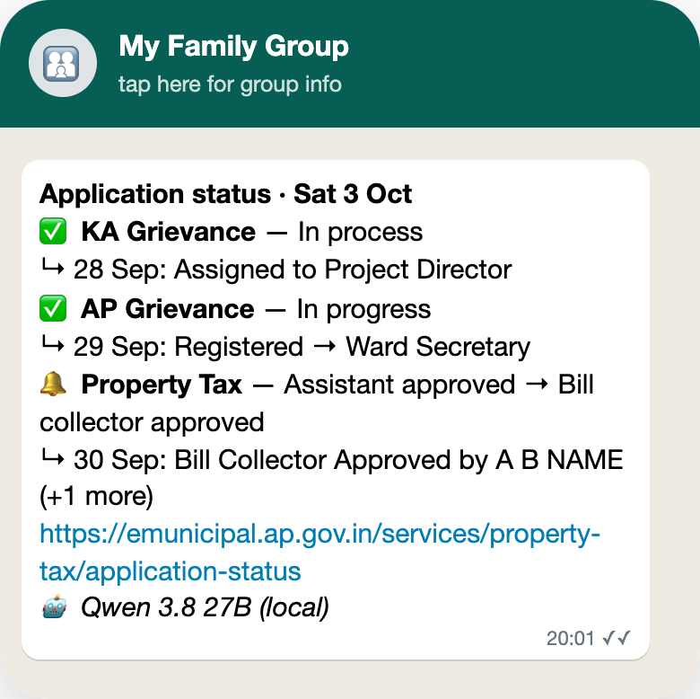

<h1 align="center">🏛️ PGRS Status Bot</h1>

<p align="center">
  <b>Government grievances move slowly, and every portal hides the status behind a captcha.<br>
  This bot checks them for you and sends one short WhatsApp, twice a day.</b>
</p>

<p align="center">
  
</p>

<p align="center">
  
  
  
  
</p>

<p align="center">
  
</p>
<p align="center"><sub>The digest in the family group (sample data): ✅ no change · 🔔 something moved, with a link</sub></p>

## 💡 Why

A complaint to a government office can take weeks, and the only way to know is to open each portal, type the
reference number, solve a captcha and read a long history table. Doing that for three applications, twice a day, is
nobody's favourite job, so this bot does it and tells the family only what changed.

## ⚙️ How it works

<table>
  <tr>
    <td align="center" width="33%"><h3>🔎</h3><b>Checks the portals</b><br><sub>Karnataka IPGRS, AP PGRS and AP eMunicipal, all at once, at 10:00 and 20:00</sub></td>
    <td align="center" width="33%"><h3>🧠</h3><b>Solves the captchas</b><br><sub>A local AI model reads each captcha; a wrong guess just tries again</sub></td>
    <td align="center" width="33%"><h3>💬</h3><b>One short WhatsApp</b><br><sub>One line per application; 🔔 marks a change, with the newest update and a link</sub></td>
  </tr>
</table>

If the Mac was asleep at send time, it sends 10 minutes after it wakes. A send time is never sent twice.

## 🚀 Set it up

<table>
  <tr>
    <td align="center" width="33%"><b>1 · Fill in</b><br><sub>Copy <code>.env.example</code> to <code>.env</code>: your application numbers, mobile and WhatsApp group</sub></td>
    <td align="center" width="33%"><b>2 · Link WhatsApp</b><br><sub><code>npm run login</code> and scan the QR (WhatsApp › Linked devices)</sub></td>
    <td align="center" width="33%"><b>3 · Switch it on</b><br><sub><code>npm run schedule</code>. To send right now: double-click <code>run-now.command</code></sub></td>
  </tr>
</table>

Needs a Mac with Node 24+, Google Chrome and [LM Studio](https://lmstudio.ai) with Qwen3.8 27B.

## 🔒 Private by design

Your numbers and group name stay in `.env` on your Mac and are never committed. The AI runs on the Mac; only the
status lookups and the WhatsApp message leave it.

<details>
<summary><b>🛠️ For developers</b></summary>

<br>

<p>
  
  
  
</p>

- **One run = collect → decide → act.** Collect: IPGRS (JSON API, 5-character captcha), PGRS (headless Chrome, a
  new one per try, an 8 s wait before submitting, case-sensitive 6-character captcha), eMunicipal (public JSON
  API), in parallel; up to `captchaTries` per site. Decide: compare with the last sent result. Act: send, then save.
- **The model** is shared with the other bots through a lease protocol (`kit.js`): loaded once, reused, unloaded by
  the last one out; LM Studio's memory guardrail stays on. If it can't be had, the run exits 75 and is retried.
  Captchas are read as plain text (measured more accurate than a JSON schema on Qwen3.8).
- **WhatsApp** is one linked login shared with school-reminder-bot (`whatsappDir`: `~/.local/state/whatsapp`); the
  bots take turns via a lock. It's released before WhatsApp starts Chrome.
- **Scheduling:** launchd runs `node kit.js tick` every 5 min: once per `runTimes` slot, 10 min after boot/wake,
  retries after 5 min ×3 then every 30 min, skips slots older than 10 h.

```
bot.js            the run: collect → decide → act
sources.js        the three sites (HTTP, headless Chrome)
rules.js          captcha prompt, digest text (pure, tested)
kit.js            shared kit: config, log, store, model sharing, WhatsApp, run, scheduler
test.js · kit.test.js       npm test
config.json       public settings (runTimes, timezone, whatsappDir, captchaTries, debugCaptcha, model)
.env.example      personal values template (.env is gitignored)
pii-check.sh      personal-data gate: bash pii-check.sh && git commit ...
run-now.command   double-click = npm start
data/             (gitignored) bot.db · bot.log · run.out · schedule.json · pgrs-last.html
```

**Commands:** `npm start` · `npm test` · `npm run login` · `npm run schedule` / `unschedule`.
**When something fails:** a macOS notification; details in `data/bot.log` (`FAILED during …`) and `data/run.out`.
**License:** MIT.

</details>
